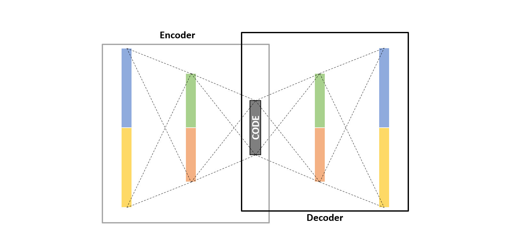
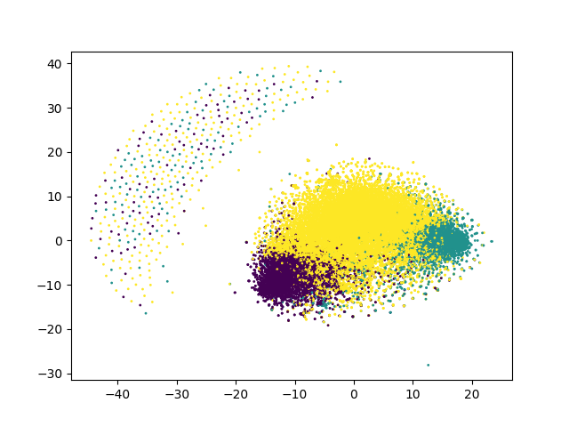
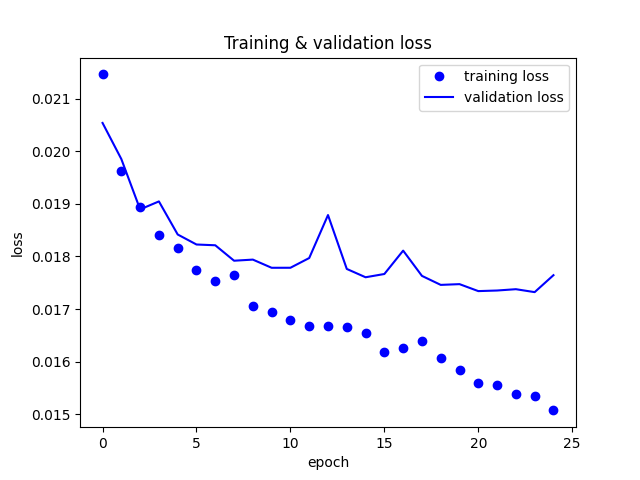
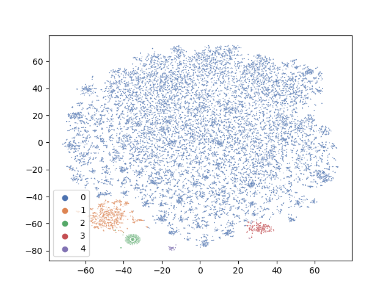
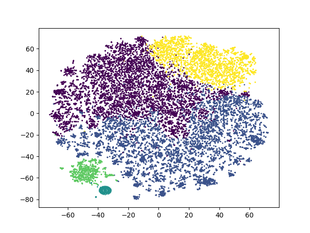
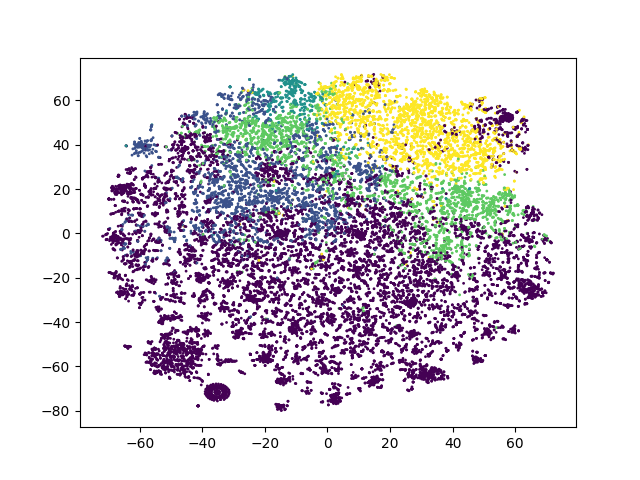

# Autoencoder with Manifold Learning for Clustering in Python



## Clustering the Manifold of the Embeddings Learned by Autoencoders
Whenever we have unlabeled data, we usually think about doing clustering. Clustering helps find the similarities and relationships within the data. Clustering algorithms like Kmeans, DBScan, Hierarchical, give great results when it comes to unsupervised learning. However, it doesn’t always depend only on the algorithm itself. How the data is organized and processed affect the algorithm performance as well. Sometimes, changing how the data looks like, gives better clusters than changing the algorithm or going to deep neural networks.

Here we will have a look at a new way of approaching clustering. We will discuss how we can manipulate the representation of data to achieve higher quality clustering.

We will:

1) use an [autoencoder](https://en.wikipedia.org/wiki/Autoencoder) that can learn the lower dimensional representation of the data capturing the most important features within it.
2) perform [manifold learning](https://en.wikipedia.org/wiki/Nonlinear_dimensionality_reduction) such as UMAP to further lower the dimensions of data.
3) apply clustering algorithm on the output of UMAP. We will use both [DBSCAN](https://en.wikipedia.org/wiki/DBSCAN) and [KMeans](https://en.wikipedia.org/wiki/K-means_clustering) algorithms.

This approach is based on [N2D: (Not Too) Deep Clustering via Clustering the Local Manifold of an Autoencoded Embedding paper](https://arxiv.org/abs/1908.05968). A really great paper to read.

The data we will use is the [IMDB Moview Review dataset](https://www.kaggle.com/lakshmi25npathi/imdb-dataset-of-50k-movie-reviews), as it is a great example for sparse data. In a [previous blog](https://minimatech.org/sentiment-prediction-using-cnn-lstm-keras/), we have worked on the same data to develop a classification deep learning model to predict sentiment. The data consists of 50K movie reviews and their sentiment labels. Here we will only focus on the reviews and try to find similar users based on their reviews. It may not sound as a proper use case, but it serves as a good example for the approach as sparse data can sometimes be difficult to cluster.

Data Preparation
We will first read the data and clean the reviews column as it may have some HTML tags and English stop words that we don’t need like (the, is, are, be etc).

```python 
import pandas as pd
reviews = pd.read_csv("IMDB Dataset.csv")
reviews.head()
#                                               review sentiment
# 0  One of the other reviewers has mentioned that ...  positive
# 1  A wonderful little production. <br /><br />The...  positive
# 2  I thought this was a wonderful way to spend ti...  positive
# 3  Basically there's a family where a little boy ...  negative
# 4  Petter Mattei's "Love in the Time of Money" is...  positive
reviews.shape
# (50000, 2)
import re
from sklearn.feature_extraction import text
stop_words = text.ENGLISH_STOP_WORDS
def clean_review(review, stopwords):
    html_tag = re.compile('<.*?>')
    cleaned_review = re.sub(html_tag, "", review).split()
    cleaned_review = [i for i in cleaned_review if i not in stopwords]
    return " ".join(cleaned_review)
## cleaning the review column
reviews["cleaned_review"] = reviews["review"].apply(lambda x: clean_review(x, stop_words))
```
N.B. It is a good practice to have all your import statements at the beginning of the script. However, here we want to highlight what library every class and function belong to. 
Now we will split the data into train and test. However, for simplicity we will be using the train dataset only for clustering. But we will use a part from test dataset in autoencoder validation.
```python
from sklearn.model_selection import train_test_split
## we will do the splitting using a random state to ensure same splitting every time
X_train, X_test, y_train, y_test = train_test_split(reviews.cleaned_review, 
                                                    reviews.sentiment, 
                                                    test_size = .5,
                                                    random_state = 13)
```
We split the data into two halves and now without the label column.

It is time now to convert the text reviews into numerical representation. Here we will use CountVectorizer Class from Scikit-Learn.
```python
from sklearn.feature_extraction.text import CountVectorizer
## maximum features to keep (based on frequency)
max_features = 5000
## stop words were already removed before
vectorizer = CountVectorizer(lowercase = True, stop_words = stop_words,
                             max_features = max_features)
vectorizer.fit(X_train) 
review_vectors = vectorizer.transform(X_train) 
review_vectors = review_vectors.toarray() 
print(len(vectorizer.vocabulary_))
# 5000
```
Now, let’s directly try to cluster the data and visualize it using the usual approach:
```python
from sklearn.cluster import KMeans
from sklearn.manifold import TSNE
import matplotlib.pyplot as plt
## arbitrary number of clusters
kmeans = KMeans(n_clusters = 3, random_state = 13).fit_predict(review_vectors)
tsne = TSNE(n_components = 2, metric = "euclidean", random_state = 13).fit_transform(review_vectors)
plt.scatter(tsne[:, 0], tsne[:, 1], c = kmeans, s = 1)
plt.show()
# plt.clf() # to clear it
```



Not that good, right?!

Now let’s have a look at the N2D approach.

## Autoencoder
As we have mentioned, the role of the autoencoder is to try to capture the most important features and structures in the data and re-represent it in lower dimensions. We will build our autoencoder with Keras library.

An autoencoder mainly consists of three main parts; 1) Encoder, which tries to reduce data dimensionality. 2) Code, which is the compressed representation of the data. 3) Decoder, which tries to revert the data into the original form without losing much information.

First import all functions and classes;

```python
from keras.models import Model
from keras.layers import Dense, Input
from keras.preprocessing import sequence
```
We then make sure that all vectors have the same length within the data and truncate them into maximum length.

```python
max_len = 500
review_train = sequence.pad_sequences(review_vectors, maxlen = max_len)
```
Before building the model, let’s construct our validation dataset that we will use to validate model performance.

```python
## a subset from the test data
review_test = vectorizer.transform(X_test[:2000]).toarray()
review_test = sequence.pad_sequences(review_test, maxlen = max_len)
```
Now to the model. We will define three layers in both encoder and decoder. Most importantly the “bottleneck” layer which will be the compressed representation of the data to be used later.

```python
## define the encoder
inputs_dim = review_train.shape[1]
encoder = Input(shape = (inputs_dim, ))
e = Dense(1024, activation = "relu")(encoder)
e = Dense(512, activation = "relu")(e)
e = Dense(256, activation = "relu")(e)
## bottleneck layer
n_bottleneck = 10
## defining it with a name to extract it later
bottleneck_layer = "bottleneck_layer"
# can also be defined with an activation function
# also note that a linear activation function can be used instead of relu
bottleneck = Dense(n_bottleneck, name = bottleneck_layer)(e)
## define the decoder (in reverse)
decoder = Dense(256, activation = "relu")(bottleneck)
decoder = Dense(512, activation = "relu")(decoder)
decoder = Dense(1024, activation = "relu")(decoder)
## output layer
output = Dense(inputs_dim)(decoder)
## model
model = Model(inputs = encoder, outputs = output)
model.summary()
# Model: "model"
# _________________________________________________________________
# Layer (type) Output Shape Param #
# =================================================================
# input_2 (InputLayer) [(None, 500)] 0
# _________________________________________________________________
# dense_14 (Dense) (None, 1024) 513024
# _________________________________________________________________
# dense_15 (Dense) (None, 512) 524800
# _________________________________________________________________
# dense_16 (Dense) (None, 256) 131328
# _________________________________________________________________
# bottleneck_layer (Dense) (None, 10) 2570
# _________________________________________________________________
# dense_17 (Dense) (None, 256) 2816
# _________________________________________________________________
# dense_18 (Dense) (None, 512) 131584
# _________________________________________________________________
# dense_19 (Dense) (None, 1024) 525312
# _________________________________________________________________
# dense_20 (Dense) (None, 500) 512500
# =================================================================
# Total params: 2,343,934
# Trainable params: 2,343,934
# Non-trainable params: 0
# _________________________________________________________________
```
The layer we are interest in the most is the “bottleneck_layer”. So after training the autoencoder, we will extract that layer with its trained weights to reshape our data.

```python
## extracting the bottleneck layer we are interested in the most
## in case you haven't defined it as a layer on it own you can extract it by name 
#bottleneck_encoded_layer = model.get_layer(name = bottleneck_layer).output
## the model to be used after training the autoencoder to refine the data
#encoder = Model(inputs = model.input, outputs = bottleneck_encoded_layer)
# in case you defined it as a layer as we did
encoder = Model(inputs = model.input, outputs = bottleneck)
```
Now it is time to compile and fit our model.

```python
model.compile(loss = "mse", optimizer = "adam")
history = model.fit(
    review_train,
    review_train,
    batch_size = 32,
    epochs = 25,
    verbose = 1,
    validation_data = (review_test, review_test)
)
# Epoch 1/25
# 782/782 [==============================] - 8s 9ms/step - loss: 0.0232 - val_loss: 0.0205
# ...
# ...
# Epoch 25/25
# 782/782 [==============================] - 6s 8ms/step - loss: 0.0152 - val_loss: 0.0176
```
Let’s visualize the loss vs the epochs.

```python
history_dict = history.history
loss_values = history_dict["loss"]
val_loss_values = history_dict["val_loss"]
epochs = range(25)
plt.plot(epochs, loss_values, "bo", label = "training loss")
plt.plot(epochs, val_loss_values, "b", label = "validation loss")
plt.title("Training & validation loss")
plt.xlabel("epoch")
plt.ylabel("loss")
plt.legend()
plt.show()
# plt.clf() # to clear
```


The model seems to be performing well. Of course there is still a big area of improvement but we will continue with it like that at the moment. So now let’s use the trained weights from the bottleneck layer to re-present our data.

```python
## representing the data in lower dimensional representation or embedding
review_encoded = encoder.predict(review_train)
review_encoded.shape
# (25000, 10)
```
Perfect! We have the data encoded into 10 dimensions only. Now let’s move to the next step. The manifold learning.

## UMAP
The next step is to use manifold learning to further reduce the encoded data dimensions. Autoencoders don’t take the local structure of the data into consideration, while manifold learning does. So combining them can lead to better clustering.

We will build a UMAP model and run it upon the encoded data.

```python
## install umap library use
# pip install umap-learn
import umap.umap_ as umap
review_umapped = umap.UMAP(n_components = n_bottleneck / 2, 
                           metric = "euclidean",
                           n_neighbors = 50, 
                           min_dist = 0.0,
                           random_state = 13).fit_transform(review_encoded)
review_umapped.shape
# (25000, 5)
```
We can also build an Isomap model, in case there are some issues with “umap-learn” installation. However UMAP, if available, shows better performance and faster.

```python
from sklearn.manifold import Isomap
import numpy as np
np.random.seed(13)
review_isomapped = Isomap(n_components = n_bottleneck / 2,
                          n_neighbors = 50,
                          metric = "euclidean").fit_transform(review_encoded)
```
## DBSCAN / KMeans
The last step is to use the clustering algorithm over the “umapped” data. We will use DBSCAN now, to leave it to the algorithm to decide the number of clusters.

We will also re-use the KMeans algorithm to compare, by visualization, the clusters using the simple approach and the approach discussed here.

```python
from sklearn.cluster import DBSCAN
import numpy as np
np.random.seed(13)
clusters = DBSCAN(
    min_samples = 50,
    eps = 1
).fit_predict(review_umapped)
len(set(clusters))
# 5
```
## Clusters Visualization
It is time now to evaluate the performance of this approach and the quality of the clusters it produces. We will try to visualize the clusters from different angles to see the effect of the N2D approach.

TSNE will be used, again as earlier, to assist in visualizing the clusters by reducing the “review_encoded” data into 2 dimensions.

N.B. UMAP can be used again here for visualization instead of TSNE and actually it is faster.

```python
import seaborn as sns
tsne2 = TSNE(2, metric = "euclidean", random_state = 13).fit_transform(review_encoded)
sns.scatterplot(tsne2[:, 0], tsne2[:, 1], 
                hue = clusters, palette = "deep",
                alpha = 0.9, s = 1,
                legend = "full")
```


As we can clearly see, this approach has led to better separation among clusters from totally sparse high dimensional data. Of course, the data may need better cleaning especially the text and models parameters can be better adjusted. But the clusters are well separated at least.

Now let’s try to run again the KMeans algorithm on the “UMAPped” data and see how different the quality of the clusters will be than the initial attempt.

```python
kmeans2 = KMeans(n_clusters = 5, random_state = 13).fit_predict(review_umapped)
plt.scatter(tsne2[:, 0], tsne2[:, 1], c = kmeans2, s = 1) 
plt.show()
```


A really big difference than the initial one! Clusters seem to be very well separated than before. With taking more care of data preprocessing step, better results may be obtained.

Finally, out of curiousity, why not looking at how KMeans could perform on the encoded data without UMAPing it.

```python
kmeans3 = KMeans(n_clusters = 5, random_state = 13).fit_predict(review_encoded)
plt.scatter(tsne2[:, 0], tsne2[:, 1], c = kmeans3, s = 1) 
plt.show()
```


It is very clear the effect of both techniques together on the clustering algorithms.

P.S. your result may vary a bit due to the random nature of autoencoder algorithms.
